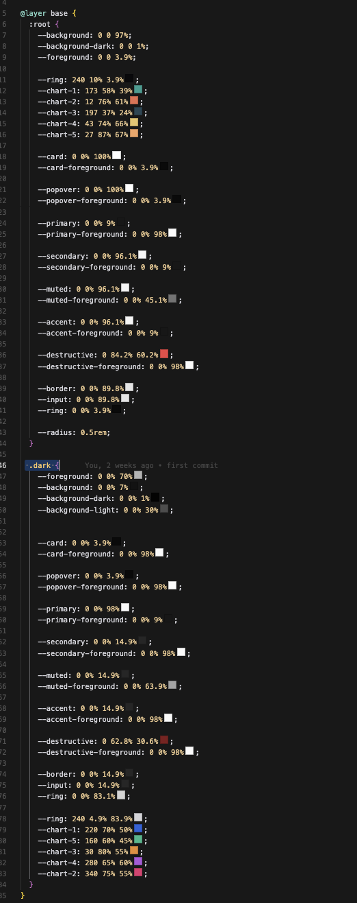

# Shadcn

## Here is shadcn variables with a little explanation as why they use it and why thoses are pertinent 

```css
  :root {
    --background:...;
    --foreground:...;
  
    --card:...;
    --card-foreground:...;
    --popover:...;
    --popover-foreground:...;
  
    --primary:...;
    --primary-foreground:...;
    --secondary:...;
    --secondary-foreground:...;
    --muted:...;
    --muted-foreground:...;
    --accent:...;
    --accent-foreground:...;
    --destructive:...;
    --destructive-foreground:...;

    --border:...;
    --input:...;
    --ring:...;
    --radius:...;
    --chart-1:...;
    --chart-2:...;
    --chart-3:...;
    --chart-4:...;
    --chart-5:...;
  }
```

- background is the background color of the app
- foreground is the color of the text

now there are some foreground background variation for specific context.

- background card / popover
- foreground card / popover


after there is some color and `accent` 

- background primary / secondary / muted / destructive / accent
- foreground primary / secondary / muted / destructive / accent

now there is utility for border, input, ring, radius, chart, etc.



## Why i think it's the good solution

Well we should have as less variables as possible, so naming thing like foreground and background is nice and easy to understand.

it's a better alternative to tailwindcss that use a default class and `.dark` for dark mode. Component should take only one input which will vary according the the current theme that is much easier to code.